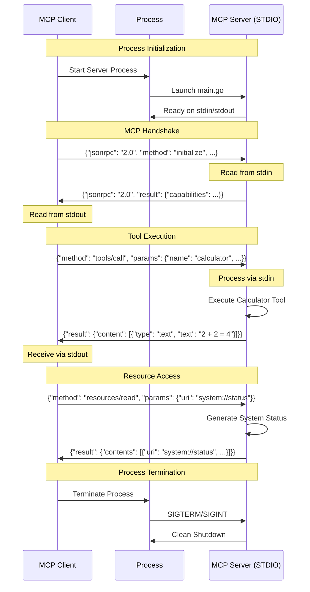
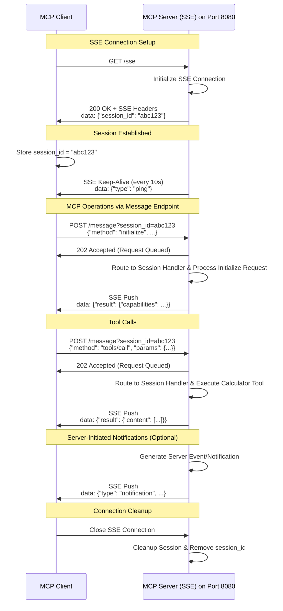
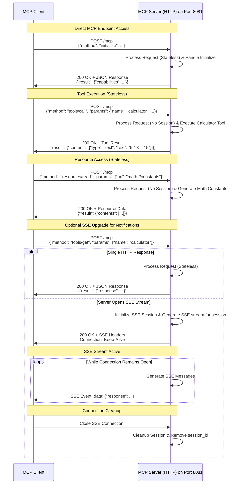
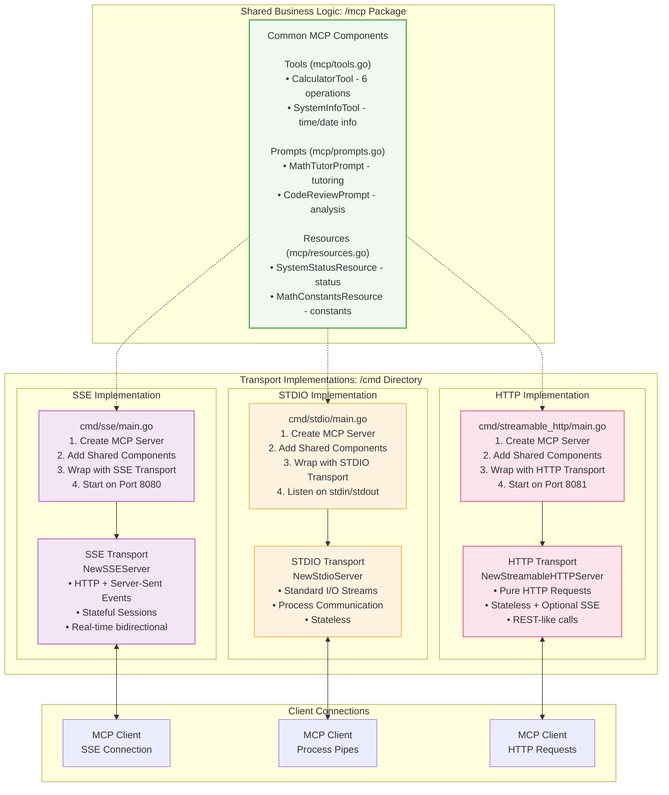

# MCP Tutorial Server Architecture

This document provides visual diagrams to help understand the different MCP (Model Context Protocol) server implementations in this tutorial project.

## Overview

The tutorial provides three different MCP server implementations:
- **SSE (Server-Sent Events)**: HTTP-based with real-time streaming
- **STDIO**: Standard input/output based communication  
- **Streamable HTTP**: HTTP-based with stateless streaming

All implementations share the same core MCP functionality but use different transport mechanisms.

## Client-Server Transport Patterns

### STDIO Transport Flow

The STDIO implementation uses standard input/output streams for direct process communication.



### SSE Transport Flow

The SSE implementation uses HTTP with Server-Sent Events for real-time bidirectional communication.



### Streamable HTTP Transport Flow

The Streamable HTTP implementation provides stateless HTTP communication with optional SSE upgrade for notifications.



## MCP Tutorial Server Architecture

This unified architecture diagram shows how the MCP Tutorial Server uses a pluggable transport design with shared business logic components.



## Getting Started

### SSE Server
```bash
go run cmd/sse/main.go
# Server starts on http://localhost:8080
```

### STDIO Server  
```bash
go run cmd/stdio/main.go
# Communicates via stdin/stdout
```

### Streamable HTTP Server
```bash
go run cmd/streamable_http/main.go  
# Server starts on http://localhost:8081
```

## Core MCP Components

All implementations share these components:

### Tools
- **Calculator**: Performs basic math operations (add, subtract, multiply, divide, power, sqrt)
- **System Info**: Provides current time/date in various formats

### Prompts
- **Math Tutor**: Comprehensive math tutoring with customizable topics and levels
- **Code Review**: Detailed code analysis with language-specific guidance

### Resources
- **System Status**: Server status and uptime information (JSON)
- **Math Constants**: Common mathematical constants (π, e, φ, √2) with descriptions

## Quick Start Examples

### STDIO Example
```bash
# Start the server process and communicate via pipes
echo '{"jsonrpc":"2.0","method":"tools/list","id":1}' | ./bin/stdio
```

### SSE Example
```bash
# 1. Start server: ./bin/sse
# 2. Open SSE connection: curl -N http://localhost:8080/sse
# 3. Use session_id for operations: 
curl -X POST "http://localhost:8080/message?session_id=abc123" \
  -H "Content-Type: application/json" \
  -d '{"method":"tools/list","id":1}'
```

### Streamable HTTP Example
```bash
# 1. Start server: ./bin/streamable_http
# 2. Direct MCP calls (no session needed):
curl -X POST "http://localhost:8081/mcp" \
  -H "Content-Type: application/json" \
  -d '{"method":"tools/list","id":1}'
``` 