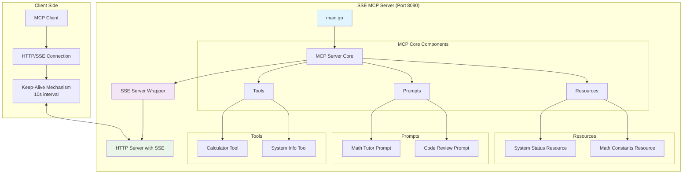
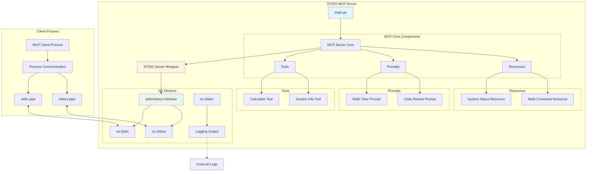
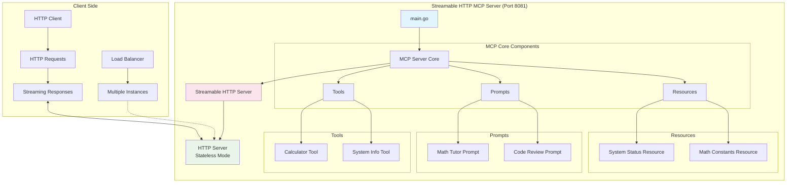
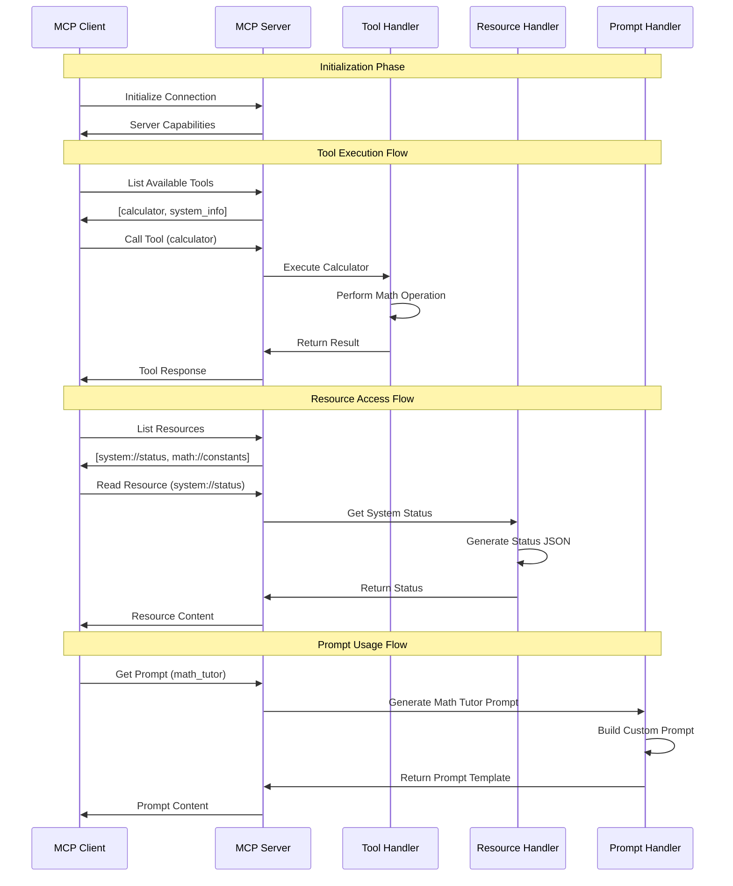

# MCP Tutorial Server Architecture

This document provides visual diagrams to help understand the different MCP (Model Context Protocol) server implementations in this tutorial project.

## Overview

The tutorial provides three different MCP server implementations:
- **SSE (Server-Sent Events)**: HTTP-based with real-time streaming
- **STDIO**: Standard input/output based communication  
- **Streamable HTTP**: HTTP-based with stateless streaming

All implementations share the same core MCP functionality but use different transport mechanisms.

## SSE Implementation Architecture

The SSE implementation uses HTTP with Server-Sent Events for real-time bidirectional communication.



## STDIO Implementation Architecture

The STDIO implementation uses standard input/output streams for communication, ideal for process-based integration.



## Streamable HTTP Implementation Architecture

The Streamable HTTP implementation provides HTTP-based communication with stateless streaming capabilities.



## MCP Protocol Flow

This diagram shows the typical request-response flow for MCP operations across all implementations.



## Comparison of Implementations

| Feature | SSE | STDIO | Streamable HTTP |
|---------|-----|-------|----------------|
| **Transport** | HTTP + SSE | stdin/stdout | HTTP Streaming |
| **Port** | 8080 | N/A | 8081 |
| **State** | Stateful | Stateful | Stateless |
| **Keep-Alive** | Yes (10s) | N/A | No |
| **Use Case** | Web browsers, real-time apps | CLI tools, process integration | REST APIs, microservices |
| **Scalability** | Moderate | Single process | High (stateless) |
| **Complexity** | Medium | Low | Medium |

## Getting Started

### SSE Server
```bash
go run cmd/sse/main.go
# Server starts on http://localhost:8080
```

### STDIO Server  
```bash
go run cmd/stdio/main.go
# Communicates via stdin/stdout
```

### Streamable HTTP Server
```bash
go run cmd/streamable_http/main.go  
# Server starts on http://localhost:8081
```

## Core MCP Components

All implementations share these components:

### Tools
- **Calculator**: Performs basic math operations (add, subtract, multiply, divide, power, sqrt)
- **System Info**: Provides current time/date in various formats

### Prompts
- **Math Tutor**: Comprehensive math tutoring with customizable topics and levels
- **Code Review**: Detailed code analysis with language-specific guidance

### Resources
- **System Status**: Server status and uptime information (JSON)
- **Math Constants**: Common mathematical constants (π, e, φ, √2) with descriptions 