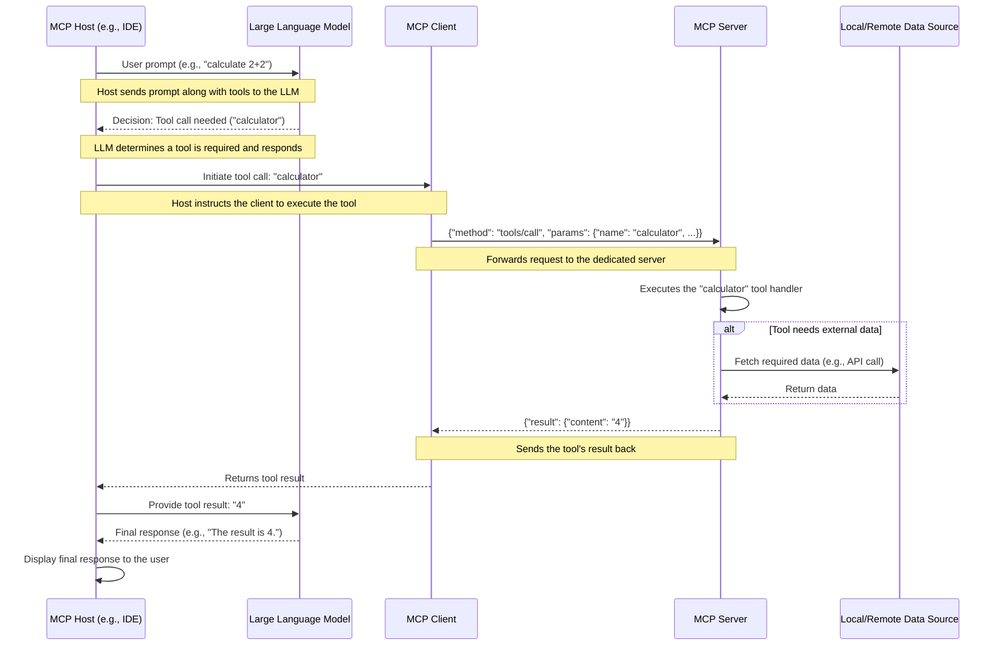

# The Model Context Protocol (MCP)

This document provides a high-level overview of the Model Context Protocol (MCP), its core concepts, and how its components interact.

## What is MCP?

The Model Context Protocol (MCP) is a standardized communication framework that enables AI assistants and development tools (MCP Hosts) to securely connect with both local and remote data sources. Inspired by the success of the [Language Server Protocol (LSP)](https://microsoft.github.io/language-server-protocol/), MCP provides a unified way for AI systems to access databases, APIs, file systems, and other services through lightweight, specialized server programs.

### Key Entities in the MCP Ecosystem

*   **MCP Hosts**: Programs like Claude Desktop, IDEs, or other AI tools that want to access data through MCP.
*   **MCP Clients**: Protocol clients that maintain a 1:1 connection with an MCP Server.
*   **MCP Servers**: Lightweight programs that expose specific capabilities through the standardized Model Context Protocol.
*   **Local Data Sources**: Your computer's files, databases, and services that MCP servers can securely access.
*   **Remote Services**: External systems available over the internet (e.g., through APIs) that MCP servers can connect to.

## Entity Interaction: A Tool Call Example

This diagram shows how the different entities interact when a user makes a request on an MCP Host that results in a tool call.

## MCP Server-Side Capabilities

MCP Servers expose their functionality through three primary capabilities, allowing for a rich and interactive experience.

*   **Tools**: Executable functions that the MCP Clients can call to perform actions, like running calculations, fetching data from an API, or accessing system information. They are dynamic and action-oriented.

*   **Resources**: Static or dynamically generated content that the MCP Clients can read for context, such as files, database records, or real-time status information. They provide a "snapshot" of data at a point in time.

*   **Prompts**: Pre-defined, templated instructions that can be retrieved and used to guide the MCP Client's behavior for specific tasks, such as code reviews or specialized tutoring. 

Model Context Protocol ref document for latest specification: 
https://modelcontextprotocol.io/introduction